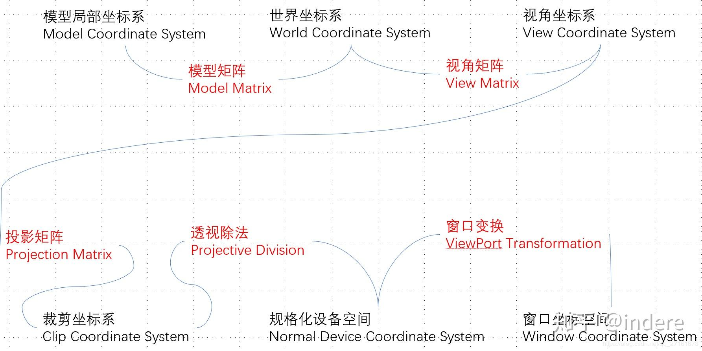
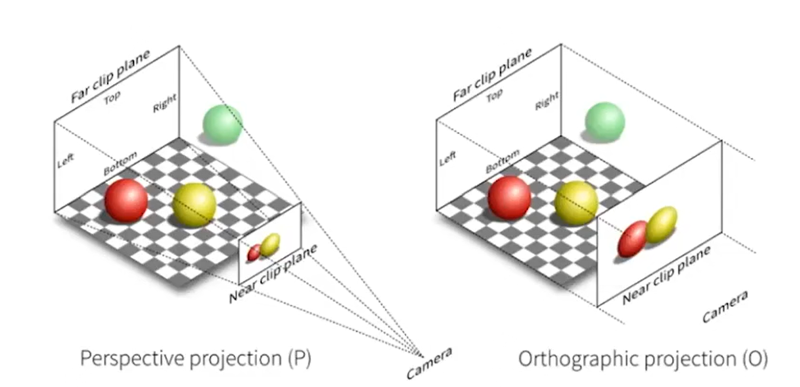
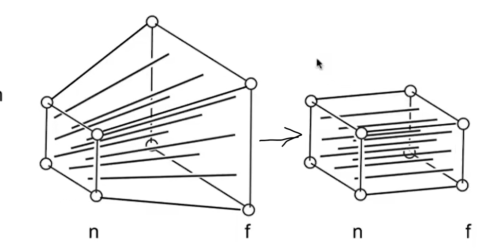
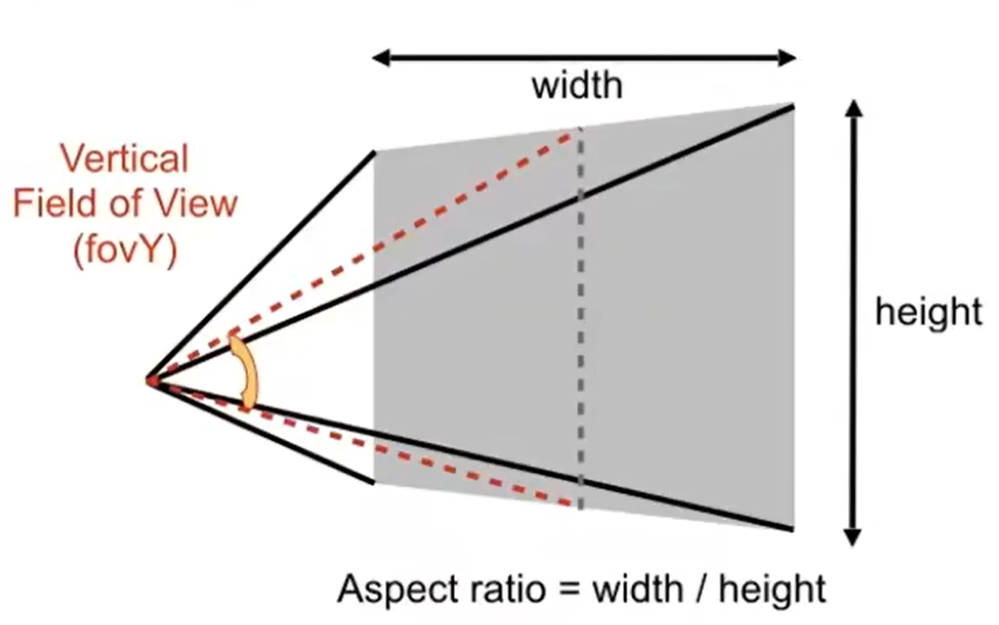
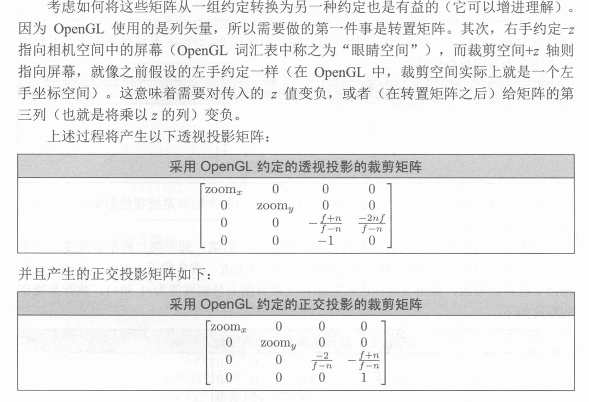
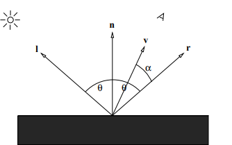
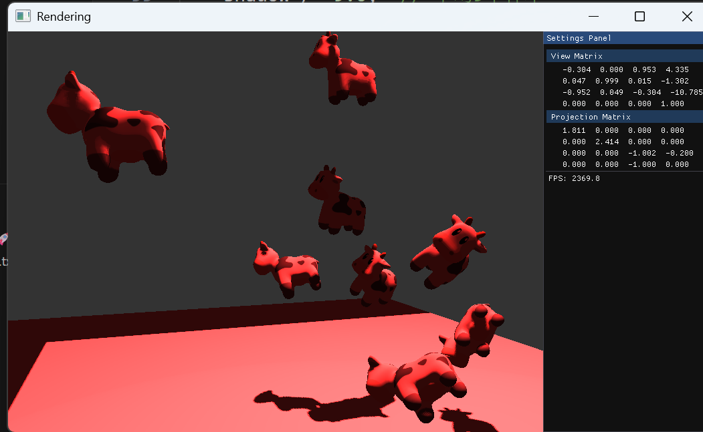

# hw02 Rendering

## MVP transformation
**Model View Projection**

### Model transfermation
**Scaling: 缩放**

$$
S = \begin{bmatrix}
S_{x}&  0&  0& 0\\ 
0&  S_{y}&  0& 0\\ 
0& 0&  S_{z}& 0\\ 
0&  0&  0& 1
\end{bmatrix}
$$

**Translating: 平移**（记得转置）

其中给定点的第四维度始终为1，这样可以转化为**齐次式**

$$
T = \begin{bmatrix}
1& 0&  0& 0\\ 
0&  1& 0& 0\\ 
0&  0&  1& 0\\ 
t_{x}& t_{y}&  t_{z}& 1\\
\end{bmatrix}
$$

**Rotation: 旋转**
分别绕x,y,z轴旋转得到

$$
R_{x}(\theta) = \begin{bmatrix}
1& 0&  0& 0\\ 
0&  cos\theta & −sin\theta& 0\\ 
0&  sin\theta &  cos\theta& 0\\ 
0& 0&  0& 1\\
\end{bmatrix}
R_{y}(\theta) = \begin{bmatrix}
cos\theta& 0&  sin\theta& 0\\ 
0&  1& 0& 0\\ 
−sin\theta&  0&  cos\theta& 0\\ 
0& 0&  0& 1\\
\end{bmatrix}
R_{z}(\theta) =\begin{bmatrix}
cos\theta &  −sin\theta &  0& 0\\ 
sin\theta &  cos\theta &  0& 0\\ 
0& 0&  1& 0\\ 
0&  0&  0& 1
\end{bmatrix}
$$

### View/Camera transformation

1. camera: Position $\overrightarrow{e}$ + look-at direction$\overrightarrow{g}$ + up direction$\overrightarrow{t}$
2. We always transform the camera to the **origin**
  
3. 将e平移到原点
4. 将g 旋转到-Z，t旋转到Y，(g × t)旋转到X
      + 容易得到逆变换（-Z,Y,X旋转到..），再求逆即可。
      + 而由于旋转矩阵是正交矩阵，因此其逆就是它的转置

### Projection Transformation

+ 3D to 2D
  + 正交投影（平行投影）：不会近大远小，类似于平行光
  + 视角投影（透视投影）(perspective Projection):
    

### **正交投影**

+ **本质是一种缩放**
+ **核心：消元，本质上是对应轴的缩放比例为0**
+ **为了保留深度信息，我们并不是降维，而是把它压缩到一个标准立方体中(NDC)**
+ **方法**
    1. 立方体的定义$[left,right] \cdot [bottom, left] \cdot [far, near]$ 注意Z轴上是先大后小
    2. 将一个立方体映射到$[-1,1]^{3}$标准立方体上
      1. 先平移到原点  $$\begin{bmatrix} 1& 0& 0& -\frac{left+right}{2}\\ 0& 1& 0& -\frac{bottom+top}{2}\\ 0& 0& 1& -\frac{near+far}{2}\\ 0& 0& 0& 1 \end{bmatrix}$$
      2. 缩放到边长为2 $$\begin{bmatrix} \frac{2}{right-left}& 0& 0& 0\\ 0& \frac{2}{top-bottom}& 0& 0\\ 0& 0& \frac{2}{near-far}& 0\\ 0& 0& 0& 1 \end{bmatrix}$$
    3. 合并得到最终的正交投影矩阵

### **视角投影**
+ **Z轴方向的非线性映射**
+ 在四元数中，一个点$(x,y,z,1)$乘以同一个数$(kx,ky,kz,k) (k\not ={0})$也是这个点。

1. **将棱台压缩为一个立方体**
2. **再对立方体进行正交投影。**

+ 所以只需求解$M_{persp->ortho}$

**规定：**
1. 远近平面固定 -> 近平面点不变，远平面的Z坐标不变
2. 设近平面的Z坐标为$n$ (-Z轴向前), 远平面的Z坐标为$f$
3. 远处平面的中心固定 $\begin{bmatrix}0\\0\\-f\\1\end{bmatrix} -> \begin{bmatrix}0\\0\\-f\\1\end{bmatrix}$

+ **变换的核心：find the relationship between the transformed points and the og points**
    + 特殊点：近平面点，远平面中心点，解得矩阵第三行

**最终解得**
$$ M_{persp->ortho} = \begin{bmatrix} n& 0& 0& 0\\ 0& n& 0& 0\\ 0& 0& n+f& -nf\\ 0& 0& 1& 0 \end{bmatrix} $$

**参数**
+ fov_y: 垂直可视角度，
+ aspect: 宽高比

+ 由fov_y和aspect可以求得near平面的宽高
  + $height = 2 \cdot near \cdot tan(fov_y/2)$
  + $width = aspect \cdot height$
  

## DEBUG MVP

1. **当鼠标上下移动时视角出现问题，仿佛像是把一个纸片向下翻或者向上翻**
  1. 定位问题：look_at 中，up 向量（或者 pitch 旋转）出现了错误，
  2. 解决方案：
      +  **重新梳理Look at的逻辑：先将Camera移动到原点，再将Camera的三个方向移动到对应的轴，**
      + 注意 **OpenGL中是右手系，而且列向量，看网上教程需注意**
      + 为了减少计算错误，先计算Z轴方向，再用已知轴去叉乘
        + z_axis = (pos - target).normalized()  // forward -g
        + x_axis = up.cross(z_axis).normalized() // right
        + y_axis = z_axis.cross(x_axis) // up
      + 对应的旋转矩阵的逆为
      + $$R^{-1} = \begin{bmatrix} x_{x} & y_{x} & z_{x} & 0\\ x_{y} & y_{y} & z_{y} & 0\\ x_{z} & y_{z} & z_{z} & 0\\ 0 & 0 & 0 & 1 \end{bmatrix}$$
      + 所以 $$R = \begin{bmatrix} x_{x} & x_{y} & x_{z} & 0\\ y_{x} & y_{y} & y_{z} & 0\\ z_{x} & z_{y} & z_{z} & 0\\ 0 & 0 & 0 & 1 \end{bmatrix}$$

## Shading and Shadow Mapping 
### Phong Reflection Model

+ 三个参数
  + Ambient: 环境光
  + Diffuse: 漫反射
  + Specular: 镜面反射
+ **计算公式**
+ $$ I = I_{ambient} + I_{diffuse} + I_{specular} $$
  $$ I_{ambient} = k_{a} \cdot I_{light} $$
  $$ I_{diffuse} = k_{d} \cdot I_{light} \cdot max(0, L \cdot N) $$ 
  $$ I_{specular} = k_{s} \cdot I_{light} \cdot max(0, R \cdot V)^{\alpha} $$
    + 其中$R$为反射向量，$V$为视线向量，$\alpha$为高光系数
+ 实际计算时，将光强作用于color向量上，即
  $$ color = I_{ambient} \cdot color + I_{diffuse} \cdot color + I_{specular} \cdot color $$    

### Debug Shading
1. glsl语言的一些注意点
2. 点积计算时，注意向量的方向
  
3. **阴影边缘过硬 、存在阴影 acne（表面斑点状阴影） ****
  阴影计算时，直接比较深度值，用固定值epsilon进行误差修正，最终值仅仅为1或0，导致阴影边缘过硬
  + 解决方案1：使用PCF（Percentage Closer Filtering）进行采样，使用3x3的采样核，对阴影值进行平均，得到一个[0,1]之间的阴影值，从而柔化阴影边缘
  + 解决方案2：动态偏移（Slope-Scaled Bias），根据光线与法线的夹角动态调整偏移值，减少阴影acne
4. **光亮部分仍然纯白**
    + 方案1：调整光源辐射率，降低光源强度，未成功
    + 方案2：调整漫反射和镜面反射的系数，主动添加一个0.3系数（因为没有专门的漫反射参数，只有辐射强度），成功，不是纯白了，有层次了。

### Extra:修改光的颜色
只需要将light_color变量修改为一个有颜色的向量即可，例如红色系

### Texture Debugger 实现

**目前未完全实现，贴图显示纯黑，经检查应当是着色器未正常处理，但没有修复好**
  
参考资料
1. Games101
2. https://www.tutorialspoint.com/computer_graphics/computer_graphics_perspective_projection.htm

3. 3D数学基础：图形与游戏开发（第二版）
4. https://www.3dgep.com/understanding-the-view-matrix/
5. EigaChineseDocument https://github.com/qixianyu-buaa/EigenChineseDocument/tree/master/Eigen
6. https://www.cnblogs.com/straywriter/articles/15599895.html
